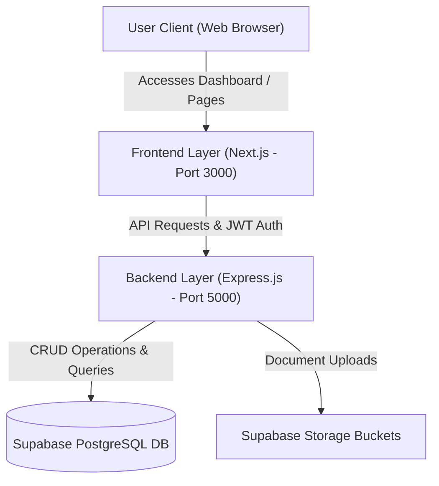

# BuildConnect - Project Overview & Implementation Status

BuildConnect is a collaborative enterprise-grade Construction Management, Real Estate Marketplace, and AI Contractor Matching SaaS platform. Designed to bridge the communication and workflow gaps between builders, specialized contractors, and administrators, the system coordinates bidding processes, automates verification compliance (Know Your Business - KYB), calculates multi-metric trust metrics, and manages construction project cycles.

---

## 🏗️ 1. Technical Architecture

BuildConnect is structured as a decoupled multi-service application:

*   **Frontend (Next.js Application):** Built using React, TypeScript, and modern styling utilities. It features a custom cream-and-slate design system located in [globals.css](file:///k:/buildconnect/frontend/app/globals.css) with Syne and DM Sans typography. Run on port `3000`.
*   **Backend (TypeScript Express Server):** Acts as the API processing layer, executing business logic, computing trust indices, handling file uploads, and processing transactions. Run on port `5000` via [server.ts](file:///k:/buildconnect/backend/server.ts).
*   **Database (Supabase Cloud PostgreSQL):** Serves as the persistent storage layer for core credentials, relational tables, role permissions, matching metadata, and security audit trails.

### System Components & Data Flows

---

## 👥 2. Core Stakeholder Roles & Access Control

Role-Based Access Control (RBAC) is enforced across the platform:
1.  **Builder (Developer/Owner):** Initiates projects, structures work packages (e.g., masonry, plumbing), reviews proposals, negotiates bidding budgets, uploads business certificates, and rates contractors.
2.  **Contractor (Specialist/Vendor):** Discovers projects, submits competitive bids and counter-proposals, compiles skill/specialty portfolios, manages verification paperwork, and tracks ratings.
3.  **Platform Administrator:** Monitors global system health, reviews pending project/builder approvals, moderates user accounts, verifies compliance documents, and oversees review disputes.
4.  **Verify-on-Visit Agent (Field Inspector - Specifications Defined):** Verifies physical milestones by submitting geo-fenced telemetry (coordinates matching construction site radius) and timestamped photo proof.

---

## 📊 3. Database Schema

The relational schema is configured in [schema.sql](file:///k:/buildconnect/backend/config/schema.sql) and enforces relational integrity via Cascades and Domain Checks:

| Table | Primary Key | Description | Key Relationships |
| :--- | :--- | :--- | :--- |
| `users` | `id` (UUID) | User accounts containing email, passwords (bcrypt), suspended flags, and roles (`admin`, `builder`, `contractor`). | - |
| `refresh_tokens` | `id` (UUID) | Volatile JWT refresh records to handle session renewals securely. | `user_id` references `users(id)` |
| `builders` | `id` (UUID) | Builder profile containing company credentials, GST/PAN information, trust indices, and approval status. | `id` references `users(id)` |
| `contractors` | `id` (UUID) | Contractor profile indicating business identifiers, success rates, completed project counts, and trust index. | `id` references `users(id)` |
| `skills` | `id` (UUID) | Master database list of construction capabilities (e.g., Plumbing, Framing). | - |
| `contractor_skills` | (`contractor_id`, `skill_id`) | Junction matching for contractor-specific capabilities. | Joint keys reference `contractors` & `skills` |
| `categories` | `id` (UUID) | Master database list of specialty domains (e.g., Electrical Works, Masonry). | - |
| `contractor_categories`| (`contractor_id`, `category_id`) | Junction matching for contractor-specific industry specialties. | Joint keys reference `contractors` & `categories` |
| `projects` | `id` (UUID) | Construction projects published by builders including description, global budget, property type, and status. | `builder_id` references `builders(id)` |
| `project_packages` | `id` (UUID) | Distinct work packages within a project containing scopes, timelines, budgets, and experience mandates. | `project_id` references `projects(id)` |
| `package_skills` | (`package_id`, `skill_id`) | Junction determining skills required to bid on a specific work package. | Joint keys reference `project_packages` & `skills` |
| `quotations` | `id` (UUID) | Bids submitted by contractors for package components, including breakdowns, counters, and status. | `package_id` & `contractor_id` references |
| `reviews` | `id` (UUID) | Project-specific contractor reviews containing ratings, text feedbacks, and detailed category sub-ratings. | `reviewer_id` & `reviewee_id` references |
| `documents` | `id` (UUID) | Metadata records for PDF/Image document assets (KYC, licenses, etc.) hosted on storage. | References target entities dynamically |
| `audit_logs` | `id` (UUID) | Append-only system logging user actions, source IPs, and transaction modifications. | `user_id` references `users(id)` |

---

## 🛠️ 4. Implemented Features & Modules

### 🔐 A. Authentication & Session Security
*   **Secure Registrations:** Registration handles password hashing using bcrypt.
*   **OTP & Verification:** Generates short-code OTPs with strict expiration windows.
*   **RBAC Route Guards:** Middlewares check token headers, decodes JWT payloads, and filters dashboard route accesses accordingly.

### 📐 B. Interactive Dashboards & Navigation UI
*   **Metric KPI Navigation:** Visual metric cards displaying metrics (e.g., *Total Projects Won*, *Success Rate*, *Pending Verification*) serve as dynamic links that automatically redirect builders, contractors, or admins to the respective listings or active tabs.
*   **Responsive Layouts:** Sidebar controls and layout views adapt dynamically for desktop and mobile viewport sizes.

### ⚖️ C. Bidding, Quotations, and Counter-Offers
*   **Detailed Breakdowns:** Bidding flow handles structured JSON budget breakdowns.
*   **Negotiation Interface:** Interactive system supporting multi-tier counters (Builder proposing a counter, Contractor adjusting parameters, or immediate Accept/Reject responses).
*   **Concurrency Safe:** Utilizes strict database transaction constraints to eliminate double-bidding anomalies.

### 🎖️ D. Dynamic Trust & AI Compatibility Indexing
*   **Trust Scoring Algorithm:** Profile validations are scored on a scale of `0-100` dynamically via [profileScoringService.ts](file:///k:/buildconnect/backend/services/profileScoringService.ts).
    *   *Builder Trust Score:* Influenced by verification approval status (50 pts), GST presence (15 pts), PAN presence (15 pts), Reg Number (10 pts), Address (5 pts), Website (5 pts).
    *   *Contractor Trust Score:* Calculated from verification approvals (40 pts), Aadhaar (15 pts), PAN (15 pts), Trade License (10 pts), Active License Upload (10 pts), Insurance Upload (10 pts).
*   **AI Profile Completeness Score:** Computes completeness metrics based on descriptions, logo graphics, active specialties, and skills associations.

### 🛡️ E. Document Upload & KYB Onboarding
*   **Secure Multi-Uploads:** Base64 upload system with S3 / Supabase storage configurations and a size safety cap of `5MB`.
*   **Verification Summaries:** If details are already verified by the admin, documents render as masked rows (e.g., `XXXX-XXXX-1234` for Aadhaar) and inputs are disabled to prevent accidental modifications unless explicitly overridden.

### 📊 F. Admin Dashboard Controls
*   **User Moderation:** Suspension toggle states that globally lock/unlock user accounts.
*   **Verification Reviews:** Portal showcasing submitted corporate credentials, tax licenses, and document previews, enabling immediate approvals or reviews.
*   **Reviews Moderation:** Active database management panel containing details of reviewer/reviewee scores and direct deletion capability.

---

## 💅 5. Recent UI/UX Polish Updates
To support a high-fidelity feel, the following polishing enhancements have been integrated:
*   **Cream/Slate Palette Integration:** Integrated high-contrast button styles, input boxes, and layout structures to unify light-cream styling (`#FAFAF8`) and dark-slate widgets (`#1C2B3A`).
*   **Inline Validation Feedbacks:** Removed invasive global notification banners on onboarding panels, replacing them with context-aware, adjacent inline error and success highlights.
*   **Scrollable Bid Modals:** Bidding reviews use viewport-constrained vertical scroll frames to prevent complex cost sheets from breaking layout parameters.
*   **Admin Dashboard Suspense Wrapping:** Admin portals parse filter variables through search route query tags wrapped under React Suspense boundaries.
